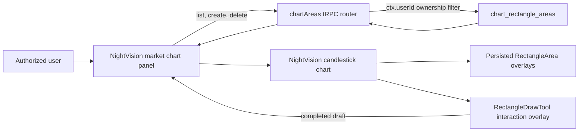

# Feature: Drawing Rectangle Areas on NightVision Charts

Date: 2026-07-20

## Goal

Allow an authorized user to define, display, and persist multiple rectangular price areas on a symbol's NightVision candlestick chart.

Each rectangle is defined by four values captured from a chart drag:

- `startTime`
- `endTime`
- `topPrice`
- `bottomPrice`

Rectangle areas are private to the authenticated user. When the user opens a chart, the application loads only that user's saved areas for the selected symbol and timeframe.

## Current Status

The feature is implemented for daily (`1d`) charts.

The current implementation supports:

- Drawing multiple rectangle areas on one chart.
- Drawing an unsaved rectangle by dragging across the chart and reviewing its values before saving.
- Persisting areas in PostgreSQL.
- Loading saved areas when a symbol's chart opens.
- Selecting an area from the saved-area list.
- Visually highlighting the selected area on the chart.
- Deleting the selected area after confirmation.
- Keeping every saved area private to its authorized owner.
- Validating drawn values in the UI, tRPC API, and PostgreSQL database.

Editing an existing rectangle is not included in the current version. A user deletes the old rectangle and adds a replacement.

## User Experience

The chart panel presents the feature under the heading `Draw a Price Range area on Chart:`. To conserve chart space, the six-color palette is enclosed in one compact outlined group, with the smaller `Add Area` and conditional `Cancel Draft` buttons directly beside it on the same row.

| Control | Purpose |
| --- | --- |
| Six color swatches | Clicking one swatch immediately arms drawing with that color. |
| `Add Area` | Validates and saves a new rectangle. |
| Row trash icon | Deletes the corresponding saved rectangle after confirmation. |
| Draft summary | Displays the captured time and price boundaries without editable inputs. |

Saved areas appear beneath the drawing controls in descending area-number order: the highest/newest area number is on top and `Area 1` remains at the bottom. Clicking an item selects it. Every area retains its saved palette color, and the selected area receives an additional white dashed outline.

Every saved-area row has its own accessible trash icon. The user does not need to select an area before deleting it, and deletion still requires confirmation.

When the selected ticker changes, the panel clears the current selection and unsaved draft, then loads the saved areas belonging to the current user for the new ticker.

## High-Level Architecture



The implementation has three primary layers:

1. The chart panel owns the draft, query, mutations, selection state, and user feedback.
2. The tRPC router validates requests and enforces authenticated ownership.
3. The NightVision chart converts saved areas into custom overlay data and renders them on the canvas.

## Main Files

| File | Responsibility |
| --- | --- |
| `components/nvcharts/nightvision-market-chart-panel.tsx` | Rectangle draft/review state, area list, selection, create/delete mutations, query refresh, and visible-range validation. |
| `components/nvcharts/nightvision-candlestick-chart.tsx` | NightVision chart lifecycle, saved/draft overlays, mouse interaction tool, event bridge, area-to-overlay conversion, and selected styling. |
| `lib/chart-area-colors.ts` | Shared six-color keys, labels, and canvas/UI color values. |
| `lib/chart-area-validators.ts` | Shared tRPC input schemas and cross-field validation rules. |
| `server/api/routers/chart-areas.ts` | Private list, create, and delete operations. |
| `server/api/root.ts` | Registers the router as `chartAreas`. |
| `server/db/schema.ts` | Drizzle definition for `chart_rectangle_areas`. |
| `drizzle/0002_plain_archangel.sql` | PostgreSQL migration for the rectangle-area table, index, and constraints. |
| `drizzle/0003_lazy_may_parker.sql` | Adds the persisted color key, defaults existing rows to sky, and adds the palette constraint. |
| `db/init.sql` | Base database initialization definition. |
| `types/night-vision.d.ts` | Local NightVision typings for custom scripts and overlay data. |

## Domain Model

The chart receives rectangle areas in the following logical form:

```ts
type ChartRectangle = {
  startTime: string;
  endTime: string;
  topPrice: number;
  bottomPrice: number;
  colorKey: "sky" | "amber" | "emerald" | "rose" | "violet" | "orange";
};

type ChartRectangleArea = ChartRectangle & {
  id: string;
};
```

`startTime` and `endTime` are date or ISO timestamp strings in React. The drawing overlay temporarily uses Unix timestamps in milliseconds and the event bridge converts them back to `YYYY-MM-DD` values for review and persistence. The API uses ISO-compatible timestamp strings at the network boundary. Prices are numbers in the client and numeric values in PostgreSQL.

The database-generated `id` is used for React identity, selection, rendering, and deletion.

## Drag-to-Review Flow

Drag drawing is an explicit interaction mode so normal chart navigation remains available when the tool is not armed.

1. The user clicks one of the six color swatches.
2. Drawing mode starts immediately, the selected swatch receives an active ring, and the chart changes to a crosshair cursor.
3. Mouse down records the first candle time and price.
4. Mouse movement renders a live translucent rectangle in the selected palette color.
5. Mouse up records the second candle time and price.
6. The drawing tool normalizes drag direction, snaps both time boundaries to real candles, and emits the four rectangle values to React.
7. React exits drawing mode and renders a dashed review draft in the selected color plus a read-only time/price/color summary.
8. `Add Area` validates and saves the draft. `Cancel Draft` clears it without calling the API.

Pressing Escape, clicking the active swatch again, leaving the chart during an active gesture, or switching tickers cancels drawing without persistence. Clicking a different swatch changes the armed color. A drag smaller than four pixels in either dimension is rejected so an ordinary click does not create a draft.

Clicking anywhere outside the complete chart container also clears the armed color. This lets the user abandon drawing by interacting with another part of the screen. Clicking inside the chart preserves the armed drawing state.

The interaction follows this state progression:

```text
idle -> armed -> dragging -> reviewing -> saving -> idle
                     |           |
                     +-> cancel <-+
```

## Add Area Flow

1. The user reviews the four values produced by a drag.
2. The panel validates the draft.
3. The panel calls `api.chartAreas.create` with the current ticker and `1d` timeframe.
4. The server obtains the owner from `ctx.userId`; the client never supplies a user ID.
5. PostgreSQL stores the rectangle.
6. The chart-area list query is invalidated and reloaded.
7. The new area appears in the saved-area list and on the chart.

The client must not treat a locally drawn rectangle as the durable source of truth. After a mutation, the database-backed query result is the authoritative state.

## Select and Delete Flow

Selection is client-side UI state represented by `selectedAreaId`.

When the user selects an area:

- The selected list item is highlighted.
- The chart receives the same `selectedAreaId`.
- The corresponding canvas overlay gains the selected outline without losing its saved color.

Clicking outside the complete chart container clears `selectedAreaId`, removing the white selection outline. Clicking inside the chart keeps the current selection visible; clicking another saved-area row selects that row normally.

When deletion is confirmed:

1. The user clicks the trash icon on a specific row and confirms deletion.
2. The panel calls `api.chartAreas.delete` with that rectangle ID.
3. The server deletes only when both `id` and `ctx.userId` match.
4. The client clears selection only if the deleted row was selected.
5. The list query is invalidated and reloaded.
6. The deleted rectangle disappears from both the list and chart.

An ID alone is never sufficient authorization to delete a row.

## NightVision Rendering Design

NightVision does not provide this rectangle behavior as a built-in overlay, so the chart registers a custom NavyJS canvas overlay named `RectangleArea`.

Each saved area becomes a separate overlay instance. This makes multiple rectangles independent and allows the selected area to have different styling without rebuilding the chart.

The overlay:

- Draws between the start and end candle positions.
- Maps `topPrice` and `bottomPrice` through the chart's price scale.
- Fills the rectangle with a translucent color.
- Draws a border around the area.
- Does not contribute its prices to automatic Y-axis range calculation.
- Does not add a legend entry.
- Uses a negative Z index so candles and normal chart information remain readable.

The chart also registers exactly one `RectangleDrawTool` overlay. It receives NightVision's mouse and keyboard hooks, converts canvas coordinates through the current chart layout, draws the live preview, and emits completed values through the NightVision event bus. React subscribes to that event and owns the review and persistence state.

While a drag is active, the tool locks chart scrolling/panning so one gesture cannot both move the chart and define an area. The lock is released on completion, validation failure, or cancellation. Persisted rectangle overlays do not contain mouse handlers, preventing one gesture from being processed once per saved area.

### Styling

| State | Appearance |
| --- | --- |
| Normal | Translucent user-selected fill with its matching one-pixel border. |
| Selected | The same saved color plus a thicker white dashed outer outline. |
| Review draft | User-selected translucent fill with a dashed matching border. |

The styling distinction is intentionally simple: selection is obvious, but the rectangle does not obscure candle bodies, wicks, or price movement.

## Time Mapping and Non-Trading Dates

The NightVision chart is configured with index-based X-axis positioning. A raw timestamp cannot always be converted directly into a stable canvas position, especially when the boundary falls on a weekend, holiday, or another date without a trading candle.

For every rectangle, the chart creates overlay data for each candle whose timestamp falls inside the requested interval. NightVision then positions the rectangle by the first and last included candle indices.

This gives the boundaries the following behavior:

- A boundary on a trading day aligns with that candle.
- A boundary on a weekend or market holiday naturally resolves to the first or last available candle inside the interval.
- Empty intervals are rejected by the panel when they do not overlap any visible trading bars.

This approach avoids inventing synthetic candles and keeps the rectangle aligned during zooming and panning.

## Chart Lifecycle

The NightVision chart instance is held in a ref and is not recreated every time the area list or selection changes.

The lifecycle is separated into two responsibilities:

- Chart construction registers the custom script and creates the NightVision instance.
- Data updates replace the candle and overlay data on the existing instance.

Keeping the chart instance stable prevents unnecessary canvas destruction, preserves interaction behavior, and avoids flicker when an area is added, selected, or deleted.

## PostgreSQL Design

Table: `chart_rectangle_areas`

| Column | Type | Rules |
| --- | --- | --- |
| `id` | UUID | Primary key; generated by PostgreSQL. |
| `user_id` | Text | Required; authenticated owner. |
| `ticker` | Text | Required; normalized to uppercase. |
| `timeframe` | Text | Required; defaults to `1d`. |
| `start_time` | Timestamp with time zone | Required. |
| `end_time` | Timestamp with time zone | Required. |
| `top_price` | Numeric(24,8) | Required and positive. |
| `bottom_price` | Numeric(24,8) | Required and positive. |
| `color_key` | Text | Required; defaults to `sky` and must be one of the six palette keys. |
| `created_at` | Timestamp with time zone | Creation audit timestamp. |
| `updated_at` | Timestamp with time zone | Last-update audit timestamp. |

The table has an index on:

```text
(user_id, ticker, timeframe)
```

This matches the normal chart-load query and prevents one user's rows from being mixed with another user's rows.

Database checks enforce:

```text
end_time >= start_time
top_price > bottom_price
top_price > 0
bottom_price > 0
color_key IN (sky, amber, emerald, rose, violet, orange)
```

These constraints are the final protection against invalid data, even if another application or future code path writes to the table.

## Private Ownership and Authorization

Authentication identifies the user, while the chart-area router enforces resource ownership.

The privacy rules are:

- The user ID always comes from the authenticated server context.
- `list` filters by `user_id`, normalized ticker, and timeframe.
- `create` inserts `ctx.userId`; it does not accept `userId` as request input.
- `delete` requires both the requested area ID and `ctx.userId` to match.
- An unauthenticated request is rejected by the protected tRPC procedure.
- Knowledge of another rectangle's UUID does not grant read or delete access.

This is application-level row ownership. If database access is later exposed to additional services, PostgreSQL Row Level Security can be added as defense in depth, but it does not replace the server checks above.

## tRPC API Contracts

The router is available as `api.chartAreas`.

### List

```ts
api.chartAreas.list.useQuery({
  ticker: "AAPL",
  timeframe: "1d",
});
```

Returns only the current user's matching areas, ordered by start time and creation time.

### Create

```ts
api.chartAreas.create.mutate({
  ticker: "AAPL",
  timeframe: "1d",
  startTime: "2026-07-01T00:00:00.000Z",
  endTime: "2026-07-10T00:00:00.000Z",
  topPrice: 225,
  bottomPrice: 210,
  colorKey: "violet",
});
```

The response contains the persisted record, including its generated ID and ISO timestamps.

### Delete

```ts
api.chartAreas.delete.mutate({
  id: "rectangle-area-uuid",
});
```

The operation succeeds only for a row owned by the authenticated user.

## Validation

Validation is intentionally layered.

### Client Validation

Before `Add Area` is submitted, the panel verifies:

- The completed drag contains all four values.
- Both dates are valid.
- Start time is not after end time.
- Both prices are positive.
- Top price is greater than bottom price.
- The requested time interval overlaps at least one visible trading bar.
- The draft color is one of the six supported palette keys.

Client validation provides immediate feedback but is not a security boundary.

### API Validation

The shared schemas verify:

- The ticker is valid and normalized to uppercase.
- The timeframe is currently the literal value `1d`.
- Date strings can be parsed.
- Price values are positive numbers.
- End time is not before start time.
- Top price is greater than bottom price.
- Color is one of `sky`, `amber`, `emerald`, `rose`, `violet`, or `orange`.

### Database Validation

PostgreSQL check constraints repeat the critical chronological and price-order rules. This protects integrity regardless of which code path writes the row.

## Loading and Error Behavior

The panel communicates the current state of the area query and mutations:

- Loading: saved areas are being retrieved for the current symbol.
- Empty: the current user has no saved areas for that symbol.
- Error: loading, creating, or deleting failed and the existing chart remains usable.
- Mutation in progress: relevant controls are disabled to prevent duplicate operations.

A failed create must not add a permanent local-only area. A failed delete must not silently remove the item from the authoritative query state.

## Database Migration and Deployment

The base table migration is stored in `drizzle/0002_plain_archangel.sql`. Color persistence is added by `drizzle/0003_lazy_may_parker.sql`; both must be applied before deploying this version of the application.

Recommended deployment order:

1. Back up the target database according to the environment's normal process.
2. Apply the Drizzle migration.
3. Verify that `chart_rectangle_areas` and its ownership lookup index exist.
4. Deploy the application code.
5. Sign in as two different test users and confirm row isolation for the same ticker.
6. Confirm create, reload, selection, and delete behavior on a daily chart.

The migration should be applied through the project's normal migration command rather than manually recreating the table, so Drizzle's migration history remains consistent.

## Test Coverage

### Chart Component Tests

`tests/components/nightvision-candlestick-chart.test.tsx` covers:

- Rendering multiple rectangle overlays.
- Resolving boundaries around non-trading dates.
- Applying selected-area styling.
- Reusing a stable NightVision chart instance.
- Registering the drawing tool, bridging a completed drag to React, and rendering the review draft.

### Chart Panel Tests

`tests/components/nightvision-market-chart-panel.test.tsx` covers:

- Draft validation and area creation.
- Loading and displaying multiple saved areas.
- Selecting and deleting an area.
- Reviewing a dragged rectangle as read-only text before saving.
- Cancelling an unsaved draft without calling the create mutation.
- Arming drawing from a color swatch and sending the selected color through the create mutation.
- Deleting a specific area from its row-level trash icon.

### API Tests

`tests/api/chart-areas-router.test.ts` covers:

- Creating and listing areas with per-user isolation.
- Preventing one user from deleting another user's area.
- Rejecting invalid time and price ranges.
- Persisting supported colors, defaulting omitted colors to sky, and rejecting unsupported keys.

## Test Database Safety

API integration tests perform database cleanup and must never point at a development or production database.

The test harness requires a database name ending in `_test`. The expected local test database is:

```text
second_brain_test
```

Before running API tests, verify that `.env.test` points to the dedicated test database. The suffix check is a safety guard, but environment configuration should still be reviewed before destructive test setup or cleanup runs.

## Acceptance Criteria

The feature is complete when all of the following are true:

- An authorized user can add more than one rectangle for a symbol.
- Every valid rectangle renders at the requested time and price boundaries.
- Saved rectangles return after a page reload.
- Switching symbols loads the correct symbol-specific set.
- Selecting an area highlights the correct rectangle.
- Deleting an area removes it from PostgreSQL, the list, and the chart.
- User A cannot list or delete User B's rectangles, including for the same ticker.
- Invalid time and price ranges are rejected before persistence.
- Dragging creates a review draft and never persists until `Add Area` is clicked.
- Clicking any palette swatch immediately arms drawing in that color.
- Saved colors survive reloads and selection does not replace the rectangle color.
- Each saved row has its own confirmed delete action; no global delete button is present.
- The palette, `Add Area`, and `Cancel Draft` controls share one compact row.
- Saved areas are displayed with the highest area number first.
- Clicking outside the chart clears both an armed palette color and the selected area's white outline.
- Cancelling drawing or a review draft does not write to PostgreSQL.
- Weekend and holiday boundaries remain aligned to real candles.
- Chart interactions continue without recreating the NightVision instance for every area-state change.

## Known Limitations and Future Extensions

The current scope is intentionally narrow:

- Only the `1d` timeframe is supported.
- Areas do not yet have names, notes, arbitrary custom colors, or categories beyond the fixed six-color palette.
- Existing areas cannot be resized or edited in place.
- Drag drawing currently targets mouse/desktop interaction; touch-specific gestures are not yet supported.
- Areas are private to one user and cannot be shared.

Possible future additions include an update mutation, drag handles, labels, arbitrary color selection, soft deletion, intraday timeframe support, and explicitly authorized team sharing. Any sharing feature must introduce a separate authorization model rather than weakening the current `user_id` ownership filter.
