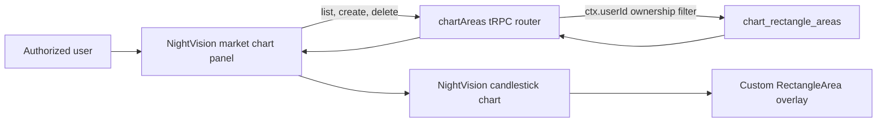

# Feature: Drawing Rectangle Areas on NightVision Charts

Date: 2026-07-20

## Goal

Allow an authorized user to define, display, and persist multiple rectangular price areas on a symbol's NightVision candlestick chart.

Each rectangle is defined by four user inputs:

- `startTime`
- `endTime`
- `topPrice`
- `bottomPrice`

Rectangle areas are private to the authenticated user. When the user opens a chart, the application loads only that user's saved areas for the selected symbol and timeframe.

## Current Status

The feature is implemented for daily (`1d`) charts.

The current implementation supports:

- Drawing multiple rectangle areas on one chart.
- Persisting areas in PostgreSQL.
- Loading saved areas when a symbol's chart opens.
- Selecting an area from the list below the input form.
- Visually highlighting the selected area on the chart.
- Deleting the selected area after confirmation.
- Keeping every saved area private to its authorized owner.
- Validating inputs in the UI, tRPC API, and PostgreSQL database.

Editing an existing rectangle is not included in the current version. A user deletes the old rectangle and adds a replacement.

## User Experience

The chart panel contains four inputs and two action buttons:

| Control | Purpose |
| --- | --- |
| Start time | Sets the left boundary of the rectangle. |
| End time | Sets the right boundary of the rectangle. |
| Top price | Sets the upper price boundary. |
| Bottom price | Sets the lower price boundary. |
| `Add Area` | Validates and saves a new rectangle. |
| `Delete Area` | Deletes the currently selected rectangle. |

Saved areas appear in a list beneath the inputs. Clicking an item selects it. The selected area receives an amber highlight on the chart, while unselected areas use the standard translucent blue style.

`Delete Area` remains disabled until an area is selected. Deletion requires confirmation before the database record is removed.

When the selected ticker changes, the panel clears the current selection and input values, then loads the saved areas belonging to the current user for the new ticker.

## High-Level Architecture



The implementation has three primary layers:

1. The chart panel owns the form, query, mutations, selection state, and user feedback.
2. The tRPC router validates requests and enforces authenticated ownership.
3. The NightVision chart converts saved areas into custom overlay data and renders them on the canvas.

## Main Files

| File | Responsibility |
| --- | --- |
| `components/nvcharts/nightvision-market-chart-panel.tsx` | Rectangle form, area list, selection, create/delete mutations, query refresh, and visible-range validation. |
| `components/nvcharts/nightvision-candlestick-chart.tsx` | NightVision chart lifecycle, rectangle overlay registration, area-to-overlay conversion, and selected styling. |
| `lib/chart-area-validators.ts` | Shared tRPC input schemas and cross-field validation rules. |
| `server/api/routers/chart-areas.ts` | Private list, create, and delete operations. |
| `server/api/root.ts` | Registers the router as `chartAreas`. |
| `server/db/schema.ts` | Drizzle definition for `chart_rectangle_areas`. |
| `drizzle/0002_plain_archangel.sql` | PostgreSQL migration for the rectangle-area table, index, and constraints. |
| `db/init.sql` | Base database initialization definition. |
| `types/night-vision.d.ts` | Local NightVision typings for custom scripts and overlay data. |

## Domain Model

The chart receives rectangle areas in the following logical form:

```ts
type ChartRectangle = {
  startTime: number;
  endTime: number;
  topPrice: number;
  bottomPrice: number;
};

type ChartRectangleArea = ChartRectangle & {
  id: string;
};
```

`startTime` and `endTime` are Unix timestamps in milliseconds inside the chart layer. The API uses ISO timestamp strings at the network boundary. Prices are numbers in the client and numeric values in PostgreSQL.

The database-generated `id` is used for React identity, selection, rendering, and deletion.

## Add Area Flow

1. The user enters the start time, end time, top price, and bottom price.
2. The panel validates the form.
3. The panel calls `api.chartAreas.create` with the current ticker and `1d` timeframe.
4. The server obtains the owner from `ctx.userId`; the client never supplies a user ID.
5. PostgreSQL stores the rectangle.
6. The chart-area list query is invalidated and reloaded.
7. The new area appears in the saved-area list and on the chart.

The client must not treat a locally drawn rectangle as the durable source of truth. After a mutation, the database-backed query result is the authoritative state.

## Select and Delete Flow

Selection is client-side UI state represented by `selectedAreaId`.

When the user selects an area:

- The selected list item is highlighted.
- The chart receives the same `selectedAreaId`.
- The corresponding canvas overlay changes to the selected style.
- The `Delete Area` button becomes available.

When deletion is confirmed:

1. The panel calls `api.chartAreas.delete` with the rectangle ID.
2. The server deletes only when both `id` and `ctx.userId` match.
3. The client clears the selection.
4. The list query is invalidated and reloaded.
5. The deleted rectangle disappears from both the list and chart.

An ID alone is never sufficient authorization to delete a row.

## NightVision Rendering Design

NightVision does not provide this rectangle behavior as a built-in overlay, so the chart registers a custom NavyJS canvas overlay named `RectangleArea`.

Each saved area becomes a separate overlay instance. This makes multiple rectangles independent and allows the selected area to have different styling without rebuilding the chart.

The overlay:

- Draws between the start and end candle positions.
- Maps `topPrice` and `bottomPrice` through the chart's price scale.
- Fills the rectangle with a translucent color.
- Draws a border around the area.
- Does not contribute its prices to automatic Y-axis range calculation.
- Does not add a legend entry.
- Uses a negative Z index so candles and normal chart information remain readable.

### Styling

| State | Appearance |
| --- | --- |
| Normal | Translucent blue fill with a one-pixel border. |
| Selected | Amber fill/border with a two-pixel border. |

The styling distinction is intentionally simple: selection is obvious, but the rectangle does not obscure candle bodies, wicks, or price movement.

## Time Mapping and Non-Trading Dates

The NightVision chart is configured with index-based X-axis positioning. A raw timestamp cannot always be converted directly into a stable canvas position, especially when the boundary falls on a weekend, holiday, or another date without a trading candle.

For every rectangle, the chart creates overlay data for each candle whose timestamp falls inside the requested interval. NightVision then positions the rectangle by the first and last included candle indices.

This gives the boundaries the following behavior:

- A boundary on a trading day aligns with that candle.
- A boundary on a weekend or market holiday naturally resolves to the first or last available candle inside the interval.
- Empty intervals are rejected by the panel when they do not overlap any visible trading bars.

This approach avoids inventing synthetic candles and keeps the rectangle aligned during zooming and panning.

## Chart Lifecycle

The NightVision chart instance is held in a ref and is not recreated every time the area list or selection changes.

The lifecycle is separated into two responsibilities:

- Chart construction registers the custom script and creates the NightVision instance.
- Data updates replace the candle and overlay data on the existing instance.

Keeping the chart instance stable prevents unnecessary canvas destruction, preserves interaction behavior, and avoids flicker when an area is added, selected, or deleted.

## PostgreSQL Design

Table: `chart_rectangle_areas`

| Column | Type | Rules |
| --- | --- | --- |
| `id` | UUID | Primary key; generated by PostgreSQL. |
| `user_id` | Text | Required; authenticated owner. |
| `ticker` | Text | Required; normalized to uppercase. |
| `timeframe` | Text | Required; defaults to `1d`. |
| `start_time` | Timestamp with time zone | Required. |
| `end_time` | Timestamp with time zone | Required. |
| `top_price` | Numeric(24,8) | Required and positive. |
| `bottom_price` | Numeric(24,8) | Required and positive. |
| `created_at` | Timestamp with time zone | Creation audit timestamp. |
| `updated_at` | Timestamp with time zone | Last-update audit timestamp. |

The table has an index on:

```text
(user_id, ticker, timeframe)
```

This matches the normal chart-load query and prevents one user's rows from being mixed with another user's rows.

Database checks enforce:

```text
end_time >= start_time
top_price > bottom_price
top_price > 0
bottom_price > 0
```

These constraints are the final protection against invalid data, even if another application or future code path writes to the table.

## Private Ownership and Authorization

Authentication identifies the user, while the chart-area router enforces resource ownership.

The privacy rules are:

- The user ID always comes from the authenticated server context.
- `list` filters by `user_id`, normalized ticker, and timeframe.
- `create` inserts `ctx.userId`; it does not accept `userId` as request input.
- `delete` requires both the requested area ID and `ctx.userId` to match.
- An unauthenticated request is rejected by the protected tRPC procedure.
- Knowledge of another rectangle's UUID does not grant read or delete access.

This is application-level row ownership. If database access is later exposed to additional services, PostgreSQL Row Level Security can be added as defense in depth, but it does not replace the server checks above.

## tRPC API Contracts

The router is available as `api.chartAreas`.

### List

```ts
api.chartAreas.list.useQuery({
  ticker: "AAPL",
  timeframe: "1d",
});
```

Returns only the current user's matching areas, ordered by start time and creation time.

### Create

```ts
api.chartAreas.create.mutate({
  ticker: "AAPL",
  timeframe: "1d",
  startTime: "2026-07-01T00:00:00.000Z",
  endTime: "2026-07-10T00:00:00.000Z",
  topPrice: 225,
  bottomPrice: 210,
});
```

The response contains the persisted record, including its generated ID and ISO timestamps.

### Delete

```ts
api.chartAreas.delete.mutate({
  id: "rectangle-area-uuid",
});
```

The operation succeeds only for a row owned by the authenticated user.

## Validation

Validation is intentionally layered.

### Client Validation

Before `Add Area` is submitted, the panel verifies:

- All four values are present.
- Both dates are valid.
- Start time is not after end time.
- Both prices are positive.
- Top price is greater than bottom price.
- The requested time interval overlaps at least one visible trading bar.

Client validation provides immediate feedback but is not a security boundary.

### API Validation

The shared schemas verify:

- The ticker is valid and normalized to uppercase.
- The timeframe is currently the literal value `1d`.
- Date strings can be parsed.
- Price values are positive numbers.
- End time is not before start time.
- Top price is greater than bottom price.

### Database Validation

PostgreSQL check constraints repeat the critical chronological and price-order rules. This protects integrity regardless of which code path writes the row.

## Loading and Error Behavior

The panel communicates the current state of the area query and mutations:

- Loading: saved areas are being retrieved for the current symbol.
- Empty: the current user has no saved areas for that symbol.
- Error: loading, creating, or deleting failed and the existing chart remains usable.
- Mutation in progress: relevant controls are disabled to prevent duplicate operations.

A failed create must not add a permanent local-only area. A failed delete must not silently remove the item from the authoritative query state.

## Database Migration and Deployment

The migration is stored in `drizzle/0002_plain_archangel.sql` and must be applied before deploying application code that calls the chart-area router.

Recommended deployment order:

1. Back up the target database according to the environment's normal process.
2. Apply the Drizzle migration.
3. Verify that `chart_rectangle_areas` and its ownership lookup index exist.
4. Deploy the application code.
5. Sign in as two different test users and confirm row isolation for the same ticker.
6. Confirm create, reload, selection, and delete behavior on a daily chart.

The migration should be applied through the project's normal migration command rather than manually recreating the table, so Drizzle's migration history remains consistent.

## Test Coverage

### Chart Component Tests

`tests/components/nightvision-candlestick-chart.test.tsx` covers:

- Rendering multiple rectangle overlays.
- Resolving boundaries around non-trading dates.
- Applying selected-area styling.
- Reusing a stable NightVision chart instance.

### Chart Panel Tests

`tests/components/nightvision-market-chart-panel.test.tsx` covers:

- Form validation and area creation.
- Loading and displaying multiple saved areas.
- Selecting and deleting an area.

### API Tests

`tests/api/chart-areas-router.test.ts` covers:

- Creating and listing areas with per-user isolation.
- Preventing one user from deleting another user's area.
- Rejecting invalid time and price ranges.

## Test Database Safety

API integration tests perform database cleanup and must never point at a development or production database.

The test harness requires a database name ending in `_test`. The expected local test database is:

```text
second_brain_test
```

Before running API tests, verify that `.env.test` points to the dedicated test database. The suffix check is a safety guard, but environment configuration should still be reviewed before destructive test setup or cleanup runs.

## Acceptance Criteria

The feature is complete when all of the following are true:

- An authorized user can add more than one rectangle for a symbol.
- Every valid rectangle renders at the requested time and price boundaries.
- Saved rectangles return after a page reload.
- Switching symbols loads the correct symbol-specific set.
- Selecting an area highlights the correct rectangle.
- Deleting an area removes it from PostgreSQL, the list, and the chart.
- User A cannot list or delete User B's rectangles, including for the same ticker.
- Invalid time and price ranges are rejected before persistence.
- Weekend and holiday boundaries remain aligned to real candles.
- Chart interactions continue without recreating the NightVision instance for every area-state change.

## Known Limitations and Future Extensions

The current scope is intentionally narrow:

- Only the `1d` timeframe is supported.
- Areas do not yet have names, notes, custom colors, or categories.
- Existing areas cannot be resized or edited in place.
- Drawing is driven by form inputs rather than click-and-drag chart interaction.
- Areas are private to one user and cannot be shared.

Possible future additions include an update mutation, drag handles, labels and colors, soft deletion, intraday timeframe support, and explicitly authorized team sharing. Any sharing feature must introduce a separate authorization model rather than weakening the current `user_id` ownership filter.
