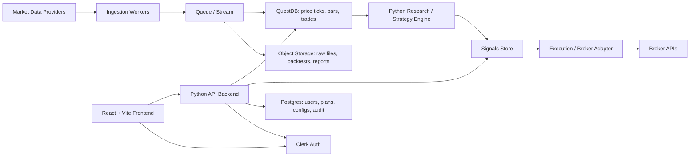

# Algotrading Web Application Architecture Brainstorming

## High-Level Architecture

The proposed stack is a strong starting point:

- QuestDB for stock price and time-series market data.
- Python backend because many finance, trading, data science, and backtesting libraries are Python-native.
- React, Vite, and TypeScript for the frontend.
- Clerk for authentication and user/session management.

The application should be split into distinct system areas:

- Market data ingestion.
- Strategy research and backtesting.
- Signal generation.
- Execution and broker integration.
- Risk management.
- User-facing web application.

The key architectural principle is that the web backend should not be responsible for everything. Trading execution, ingestion, and backtests should run in dedicated workers or services.



## Backend Recommendation

Use FastAPI unless there is a strong reason to choose another Python framework.

FastAPI is a good fit because it is:

- Python-native.
- Async-friendly.
- Easy to document with OpenAPI.
- Good for API-first applications.
- Suitable for WebSocket endpoints.
- Easy to integrate with Python finance and data libraries.

Recommended backend layout:

- FastAPI API service:
  - User dashboards.
  - Strategy CRUD.
  - Watchlists.
  - Portfolio views.
  - Auth/session verification.
  - WebSocket endpoints for live updates.

- Worker services:
  - Data ingestion.
  - Feature calculation.
  - Backtesting.
  - Signal generation.
  - Scheduled jobs.
  - Broker execution.

Do not run serious trading jobs as FastAPI background tasks. Background tasks are fine for small fire-and-forget work, but ingestion, trading, and backtesting should run in separate workers using tools such as Celery, RQ, Dramatiq, Arq, or a stream processor.

## Database Design

QuestDB is a good fit for high-volume time-series market data. It supports efficient ingestion and querying for time-series workloads.

However, QuestDB should not be the only database.

Use QuestDB for:

- Ticks.
- OHLCV bars.
- Quotes and order book snapshots.
- Time-series indicators.
- Strategy signals over time.
- Historical price analytics.

Use Postgres for:

- Users.
- Organizations.
- Subscriptions.
- Strategy definitions.
- API key metadata.
- Portfolios.
- Trade orders.
- Audit logs.
- Billing and account state.

QuestDB is excellent for time-series analytics. Postgres is better for relational app state, permissions, transactions, and durable business records.

## Frontend Recommendation

React plus Vite is a good choice for the frontend. Use TypeScript from the start.

Recommended frontend stack:

- React.
- Vite.
- TypeScript.
- Clerk React SDK.
- TanStack Query for API state.
- Zustand or Redux Toolkit only if complex client state becomes necessary.
- TradingView Lightweight Charts for market charts.
- Recharts or ECharts for portfolio and analytics charts.

The frontend should be designed as a real application, not just charts glued to API calls. Expected application areas include:

- Dashboard.
- Watchlists.
- Strategy configuration.
- Backtest results.
- Signal history.
- Portfolio view.
- Paper trading view.
- Live trading controls.
- Alerts and notifications.

## Core Services

### Market Data Service

Responsibilities:

- Pull data from providers such as Polygon, Alpaca, Twelve Data, Interactive Brokers, Tiingo, or Nasdaq Data Link.
- Normalize symbols, exchanges, timestamps, splits, and dividends.
- Store raw and normalized data.
- Support replay for debugging.

### Research / Backtest Service

Responsibilities:

- Run strategies against historical data.
- Store backtest results separately from live trading results.
- Version every strategy run with code, config, data range, and timestamp.
- Use vectorized Python libraries where possible.

### Signal Service

Responsibilities:

- Compute indicators and model outputs.
- Write signal timelines to QuestDB or Postgres depending on shape.
- Separate "signal generated" from "order placed".

### Execution Service

Responsibilities:

- Broker adapters.
- Order lifecycle tracking.
- Risk checks before order placement.
- Idempotency keys.
- Paper trading mode first.

### Risk Service

Responsibilities:

- Max position size.
- Max daily loss.
- Symbol allowlist and denylist.
- Max open orders.
- Kill switch.
- Market-hours checks.

### Notification Service

Responsibilities:

- Email, push, or webhook alerts.
- Trade execution events.
- Strategy errors.
- Risk threshold warnings.

## Event-Driven Flow

Trading systems benefit from event-driven architecture because it improves auditability, replayability, and debugging.

Example event flow:

```text
market_data_received
indicator_calculated
signal_generated
risk_check_passed
order_submitted
order_filled
position_updated
```

This makes it easier to answer important questions such as:

- Why did this strategy trade?
- What data did it see at the time?
- Which risk checks passed?
- Was the order submitted once or multiple times?
- Did the broker fill the order?

## Queue / Streaming Layer

For an MVP:

- Redis plus RQ, Dramatiq, or Arq is enough.

For a more serious production system:

- Kafka or Redpanda for market data streams.
- Redis for cache and pub/sub.
- Celery, RQ, Dramatiq, or Arq for jobs.
- QuestDB for time-series persistence.

If the first version uses minute, hourly, or daily bars, keep the architecture simple. If the app needs high-frequency tick ingestion, introduce a stream layer earlier.

## Python Finance Libraries

Useful Python libraries:

- pandas.
- polars.
- numpy.
- vectorbt for research and backtesting.
- backtrader for event-driven backtesting.
- ta-lib or pandas-ta for indicators.
- yfinance for prototypes only, not production.
- ib_insync for Interactive Brokers.
- Official SDKs from Alpaca, Polygon, or chosen providers.

For large historical datasets, consider Polars. Pandas is still common in finance, but Polars is often faster and cleaner for larger data pipelines.

## Deployment Shape

MVP deployment:

- Frontend: Vercel, Netlify, or Cloudflare Pages.
- Backend: Fly.io, Render, Railway, or AWS ECS.
- QuestDB: managed QuestDB or self-hosted VM/container.
- Postgres: managed Postgres.
- Redis: managed Redis.
- Workers: deployed as separate processes or containers.

Production trading deployment:

- Keep execution workers in a stable region close to the broker and data provider.
- Add observability from the beginning.
- Separate paper trading and live trading environments.
- Require explicit enablement for live trading.
- Keep live execution isolated from dashboard traffic.

## Security And Compliance Notes

This area is especially important if users can connect broker accounts.

Important controls:

- Encrypted broker credentials or OAuth where available.
- No broker secrets in the frontend.
- Audit logs for every config change and trade decision.
- Idempotent order submission.
- API rate limits.
- Per-user data isolation.
- Explicit paper/live trading mode.
- Kill switch.
- Complete trade decision trail.

Be careful with product language. If the application becomes user-facing investment functionality, regulatory and compliance questions may become important quickly.

## Recommended MVP Stack

Recommended starting stack:

- Frontend: React, Vite, TypeScript, Clerk, TanStack Query, TradingView Lightweight Charts.
- API: FastAPI.
- Time-series database: QuestDB.
- App database: Postgres.
- Cache and jobs: Redis plus Dramatiq or RQ.
- Data processing: pandas and Polars.
- Backtesting: vectorbt first, custom engine later if needed.
- Local development: Docker Compose.
- Deployment: managed Postgres/Redis plus containerized services.

## Suggested MVP Scope

Start with:

1. User authentication.
2. Watchlists.
3. Historical OHLCV ingestion.
4. Charting.
5. Simple strategy configuration.
6. Backtest runner.
7. Paper trading simulation.
8. Alerts.
9. Broker integration after the above is stable.

This path gives the product useful functionality before introducing real-money execution. That is the right place for the system to earn trust gradually.

## Recommended Initial Milestones

### Milestone 1: Foundation

- Set up monorepo or service folders.
- Add React/Vite frontend.
- Add FastAPI backend.
- Add Clerk auth.
- Add Postgres.
- Add QuestDB.
- Add local Docker Compose.

### Milestone 2: Market Data

- Choose first data provider.
- Build ingestion worker.
- Normalize symbols and OHLCV data.
- Store bars in QuestDB.
- Display historical chart in frontend.

### Milestone 3: Backtesting

- Add strategy config model.
- Add backtest worker.
- Store backtest results.
- Display equity curve, drawdown, trades, and metrics.

### Milestone 4: Paper Trading

- Add simulated portfolio.
- Convert signals into paper orders.
- Track fills and positions.
- Add risk limits.

### Milestone 5: Live Broker Integration

- Add broker adapter.
- Add explicit live mode enablement.
- Add audit trail.
- Add kill switch.
- Add order reconciliation.

