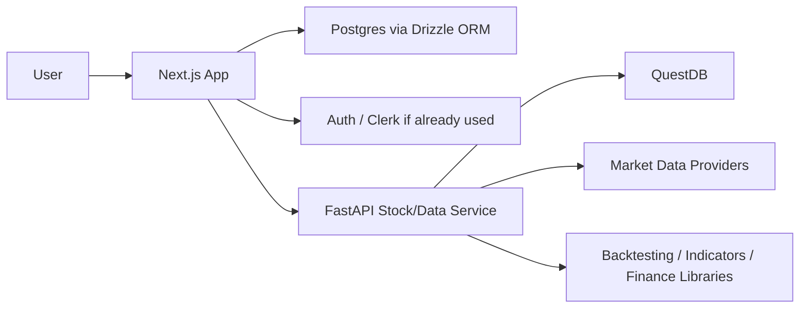

# Revised Design: Reuse Existing Next.js App

## Summary

Using the existing Next.js, Postgres, and Drizzle ORM project management app as the baseline is a very good idea for the MVP.

Instead of building a brand-new React/Vite app from scratch, reuse the existing application as the main product app and add the trading/portfolio domain gradually.

The recommended architecture is:

```text
Next.js app = product, auth, CRUD, dashboard, user workflows
FastAPI app = market data, finance math, backtesting, ingestion, QuestDB
```

This is likely a better MVP path than the original greenfield architecture because it allows faster product progress while still preserving a clean path toward a dedicated Python/QuestDB trading engine.

## Proposed Architecture



## Why This Is A Good Idea

The existing app already has:

- Working Next.js app structure.
- Working Postgres setup.
- Drizzle ORM.
- Existing auth/session patterns.
- Existing UI components.
- Existing deployment habits.
- Existing CRUD patterns.
- A known codebase and mental model.

That foundation is valuable. Reusing it means the product can reach useful functionality faster.

The first useful version of the app probably does not need full algorithmic trading. It probably needs:

- Portfolio management.
- Watchlists.
- Holdings.
- Strategy definitions.
- Trade ideas.
- Symbol views.
- CRUD flows.
- Basic market charting.
- Later market data ingestion.
- Later backtesting.
- Later broker integration.

The existing project management app is likely already good at the core product pattern: users manage structured domain objects. Portfolio and trading CRUD fits that model well.

## Phase 1: Extend Existing Next.js App

Add stock and portfolio features directly to the existing Next.js app first.

Use Postgres and Drizzle ORM for:

- Portfolios.
- Holdings.
- Watchlists.
- Symbols.
- Strategy definitions.
- Backtest records.
- Paper trading accounts.
- Trade journal entries.
- Alerts.
- Notes.
- Audit events.

At this stage, do not introduce FastAPI immediately unless Python finance libraries are needed right away.

The Next.js app can own these tables:

```text
users
organizations
portfolios
holdings
watchlists
watchlist_symbols
strategies
strategy_versions
trade_journal_entries
paper_accounts
paper_orders
paper_positions
alerts
audit_events
```

This gets the CRUD application working quickly.

## Phase 2: Add FastAPI As A Dedicated Stock/Data Service

Add FastAPI when the application needs:

- QuestDB integration.
- Historical OHLCV ingestion.
- pandas.
- Polars.
- vectorbt.
- Indicators.
- Backtesting.
- Market data provider integrations.
- Broker integrations.
- Heavier Python workflows.

FastAPI should own or mediate:

- Market data ingestion.
- QuestDB reads and writes.
- Indicator calculation.
- Backtest execution.
- Signal generation.
- Paper broker simulation.
- Future live broker integration.

The Next.js backend/API routes can call FastAPI internally.

Request flow:

```text
Browser
  -> Next.js route/action
    -> Postgres via Drizzle for app state
    -> FastAPI for stock data/backtest/indicators
      -> QuestDB / Python finance libs
```

## Important Boundary

Avoid letting both Next.js and FastAPI freely write to the same Postgres tables.

Recommended ownership:

- Next.js owns app/product tables.
- FastAPI owns time-series and market-data workflows.
- If FastAPI needs app config, Next.js passes it through an API call.
- If FastAPI produces results, it returns them to Next.js, and Next.js stores the app-facing record.

Example backtest flow:

```text
User clicks "Run Backtest"
Next.js reads strategy config from Postgres
Next.js calls FastAPI /backtests/run
FastAPI queries QuestDB and calculates result
FastAPI returns metrics/trades/equity curve
Next.js stores backtest summary in Postgres
```

This keeps ownership clean.

## Where QuestDB Fits

Do not add QuestDB on day one unless real market data ingestion is immediately needed.

Start with Postgres for app data.

Add QuestDB when the app needs:

- Large historical price datasets.
- Tick data.
- Time-series indicators.
- High-speed time-window queries.
- Backtesting over larger datasets.

Revised MVP order:

```text
Next.js + Postgres + Drizzle first
FastAPI + QuestDB second
Broker integration much later
```

## Suggested Next.js Folder Direction

Inside the existing Next.js app, add domains like:

```text
src/
  app/
    portfolios/
    watchlists/
    strategies/
    backtests/
    market/
    trade-journal/

  components/
    portfolio/
    watchlist/
    strategy/
    backtest/
    market-chart/

  db/
    schema/
      portfolio.ts
      watchlist.ts
      strategy.ts
      backtest.ts
      trading.ts

  server/
    services/
      portfolio-service.ts
      watchlist-service.ts
      strategy-service.ts
      backtest-service.ts
      fastapi-client.ts

  lib/
    market-data/
    charts/
```

Adapt this to the existing app structure rather than forcing this exact layout.

## Later Python Service Folder Direction

Later, add a sibling Python service:

```text
services/
  market-api/
    app/
      main.py
      api/
      core/
      db/
        questdb.py
      services/
        market_data_service.py
        backtest_service.py
      research/
        strategies/
        backtesting/
      integrations/
        market_data/
        brokers/
```

## Main Risk

The biggest risk is turning the Next.js app into a giant mixed-purpose app where UI, CRUD, market data, backtesting, and broker execution all live together.

Keep this rule:

```text
Next.js handles product workflows.
FastAPI handles finance/data computation.
```

Next.js can call FastAPI, but it should not become the home for Python-style quant logic.

## Recommended Sequence

1. Add portfolio, watchlist, and strategy CRUD tables in Postgres using Drizzle.
2. Build the UI flows in the existing Next.js app.
3. Add simple charting with TradingView Lightweight Charts.
4. Use mock/static OHLCV data first.
5. Add FastAPI as a separate service once the product shape is clear.
6. Add QuestDB behind FastAPI.
7. Add ingestion and backtesting.
8. Add paper trading.
9. Only then consider live trading.

This is more pragmatic than starting fresh. It gives product momentum early while preserving the ability to add a serious Python/QuestDB trading engine later.

