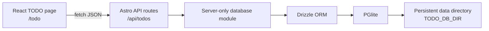

# TODO web app with PGlite and Drizzle in Astro

## Status and scope

This document describes the implemented TODO page in this Astro project. The page is a React component at `/todo`. Tasks are stored by PGlite on the Node host's disk, with Drizzle defining the schema, applying migrations, and executing queries.

The first version is one shared task list. It has no accounts or per-user task ownership. Anyone who can reach the API can read and change the list.

## Goals

- Let users add, edit, complete, reopen, delete, and filter tasks.
- Keep task data after browser closes and Node server restarts.
- Store the database on a configurable persistent disk directory on the Node host.
- Keep PGlite and filesystem access on the server; send JSON to the React page.
- Track schema changes with committed Drizzle migrations.

## Architecture



Astro renders the page and runs the API routes with the standalone Node adapter. The React component handles interaction and local view state. It never imports the database module. API routes validate requests and use Drizzle to read and write PGlite. PGlite uses its Node filesystem backend, so the browser does not store the database.

### Main files

| File | Responsibility |
| --- | --- |
| `astro.config.mjs` | Enables React and the standalone Node adapter. |
| `src/pages/todo.astro` | Defines `/todo` inside the existing `PageShell`. |
| `src/components/TodoApp.tsx` and `TodoApp.css` | React interface and styling. |
| `src/pages/api/todos/index.ts` | List and create tasks. |
| `src/pages/api/todos/[id].ts` | Update and delete one task. |
| `src/db/schema.ts` | Drizzle table definition. |
| `src/db/server.ts` | Opens one PGlite instance per Node process and runs migrations. |
| `drizzle.config.ts` and `drizzle/` | Migration generation configuration and committed migration files. |

## Data model

The `todos` table has these columns:

| Column | Type | Purpose |
| --- | --- | --- |
| `id` | serial primary key | Task identifier. |
| `title` | non-null text | Task description; API limits it to 1–200 trimmed characters. |
| `completed` | non-null boolean, default `false` | Completion state. |
| `created_at` | non-null timestamp with time zone | Creation time; defaults to the database clock. |
| `updated_at` | non-null timestamp with time zone | Last update time; set by the API on edits. |

There is no `user_id`, due date, priority, or soft delete in the current schema.

## API contract

All routes return JSON with `Cache-Control: no-store`. Successful task responses include the five fields above, using camel-case names for timestamps in JSON.

| Method | Route | Request | Result |
| --- | --- | --- | --- |
| `GET` | `/api/todos` | None | All tasks, newest first. |
| `POST` | `/api/todos` | `{ "title": "..." }` | Created task; HTTP 201. |
| `PATCH` | `/api/todos/:id` | `title`, `completed`, or both | Updated task. |
| `DELETE` | `/api/todos/:id` | None | Deleted task ID. |

Invalid JSON, titles, completion values, and IDs return HTTP 400. Updates and deletes for a missing ID return HTTP 404. Database failures return HTTP 500 with a generic client message and a server log entry. The React page shows errors and offers a retry for loading.

## Database startup and persistence

`src/db/server.ts` resolves `TODO_DB_DIR` to an absolute path. Without that variable, it uses `data/todo-pglite` relative to the Node process working directory. It creates the parent directory before opening PGlite, so a fresh checkout does not fail because `data/` is missing.

The database is a **directory of PostgreSQL data files**, not a single `.db` file. The project's `data/` directory is Git-ignored. In production, `TODO_DB_DIR` should point to a writable directory on a persistent volume outside disposable build output. Back up that directory as application data.

The first API request initializes a single database promise in the Node process, waits for PGlite to become ready, and applies any pending migrations from `drizzle/`. Later requests reuse the same connection. Start the server from this project directory because migration lookup uses the process working directory. Run one Node server process against a given PGlite directory.

## Schema changes

1. Edit `src/db/schema.ts`.
2. Run `npm run db:generate` from this project directory.
3. Review and commit the generated SQL and metadata in `drizzle/`.
4. Build and deploy the app with the updated `drizzle/` directory.
5. On the first API request, the server applies pending migrations before serving queries.

Do not edit an existing migration after it has been applied to a persistent database. Add a new migration for later changes.

## Build and run

Local development:

```sh
npm install
npm run dev
```

Production on a Node host with persistent storage:

```sh
npm run check
npm run build
TODO_DB_DIR=/absolute/path/on/persistent/storage npm start
```

The production host must retain the database directory across deployments and restarts, deploy the `drizzle/` migration files, and run the app from the project directory. A static-only host cannot provide the API or the disk-backed database.

## Access and operational boundaries

- The list is shared and unauthenticated. Put the app behind an access control layer or add authentication and task ownership before exposing private tasks publicly.
- PGlite is embedded in the Node process. Multiple Node processes should not open the same data directory.
- Browser reloads and server restarts preserve tasks because PGlite writes to disk. If the host's volume is deleted or replaced, tasks are lost unless restored from backup.
- The UI does not currently synchronize changes made in other browser tabs in real time; a page reload fetches current state.

## Verification

The implementation was checked with `npm run check` and `npm run build`. API smoke checks covered create, update, delete, and listing. A task was read back after a Node server restart. The default `data/todo-pglite` path was also tested from a fresh missing `data/` directory; the server created it and `GET /api/todos` returned HTTP 200.
